# kubernetis-dz04
Сетевое взаимодействие в Kubernetes

Задание 1: Настройка Service (ClusterIP и NodePort)
Задача
Развернуть приложение из двух контейнеров (nginx и multitool) и обеспечить доступ к ним:

Внутри кластера через ClusterIP.

Снаружи через NodePort.

Шаги выполнения
Создать Deployment с двумя контейнерами:
nginx (порт 80).
multitool (порт 8080).

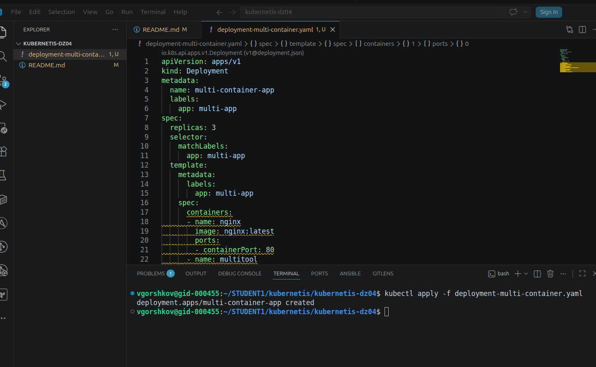

Количество реплик: 3.

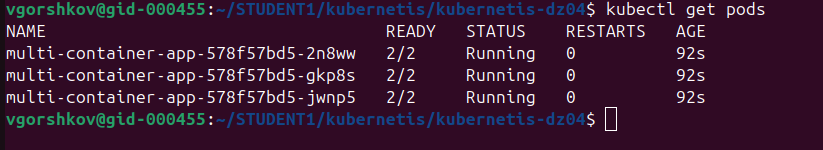

Создать Service типа ClusterIP, который:
Открывает nginx на порту 9001.
Открывает multitool на порту 9002.

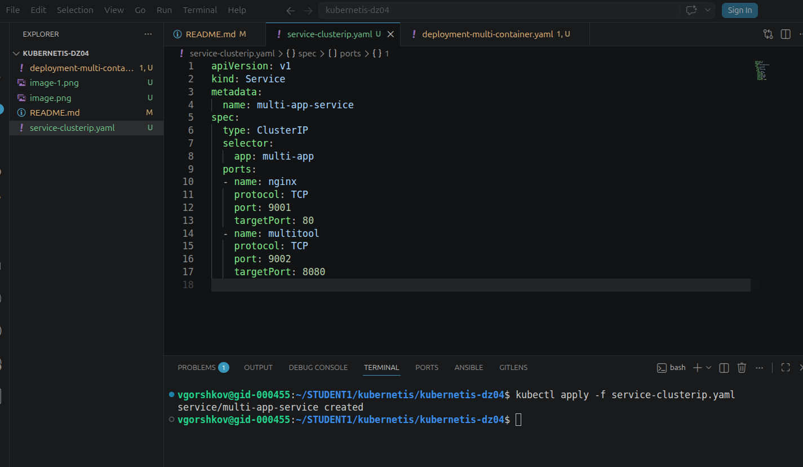

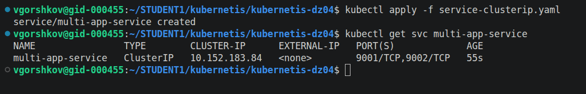

Проверить доступность изнутри кластера:
 kubectl run test-pod --image=wbitt/network-multitool --rm -it -- sh
 curl <service-name>:9001 # Проверить nginx

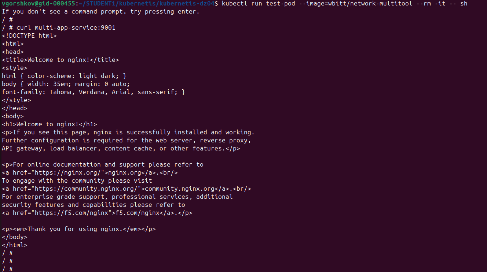

 curl <service-name>:9002 # Проверить multitool

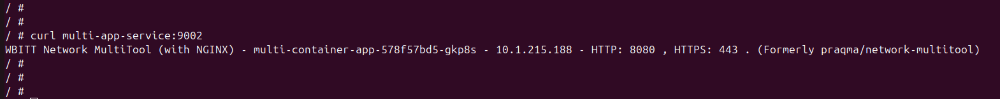

Создать Service типа NodePort для доступа к nginx снаружи.

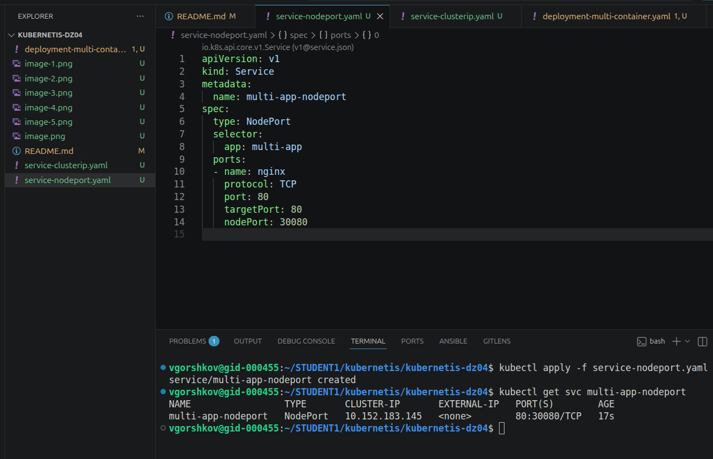

Проверить доступ с локального компьютера:
 curl <node-ip>:<node-port>

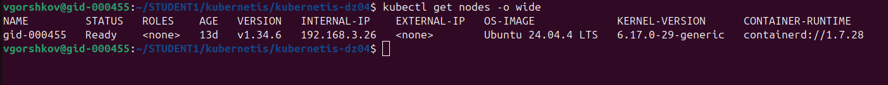

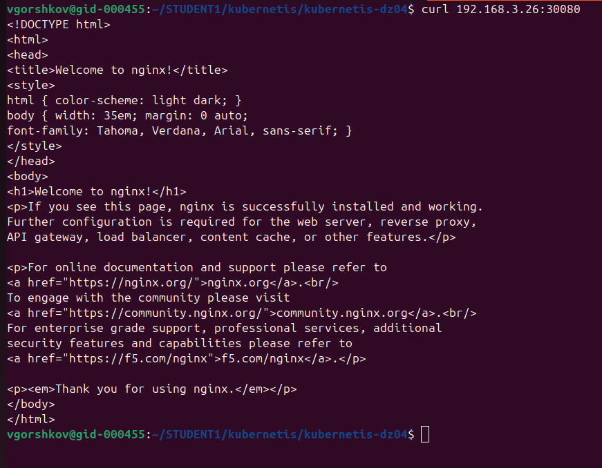

или через браузер.

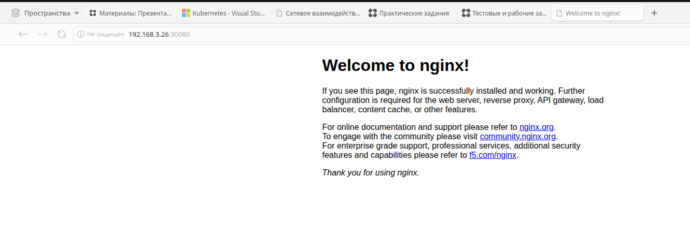

Задание 2: Настройка Ingress
Задача  "Развернуть два приложения (frontend и backend) и обеспечить доступ к ним через Ingress по разным путям."

Шаги выполнения:
Развернуть два Deployment:
frontend (образ nginx).
backend (образ wbitt/network-multitool).

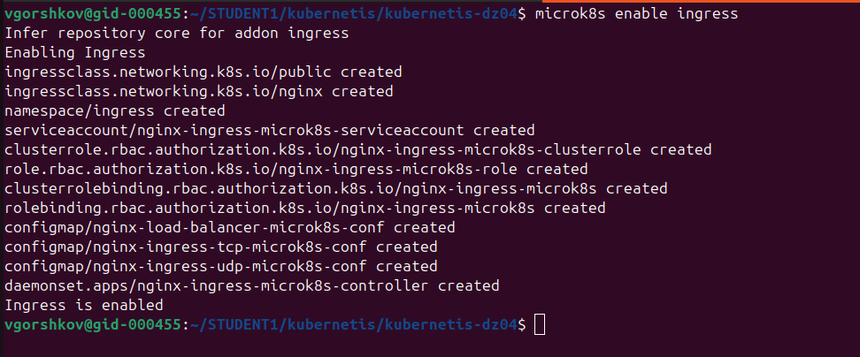

Создать Service для каждого приложения.

Включить Ingress-контроллер:
 microk8s enable ingress

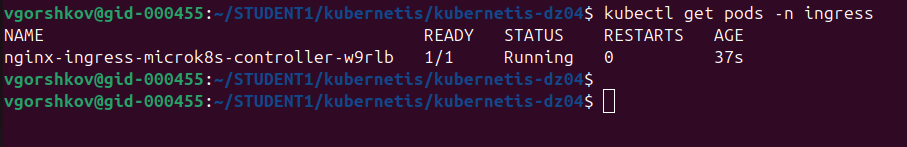

Создать Ingress, который:
Открывает frontend по пути /.
 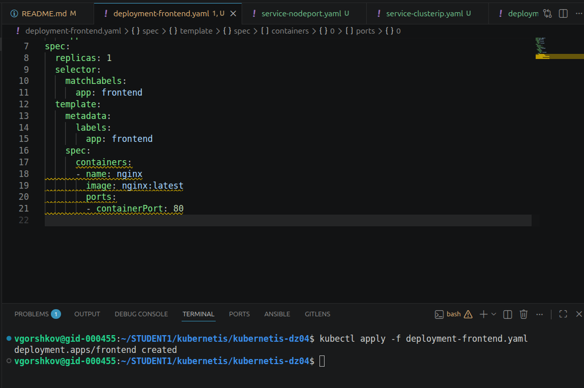

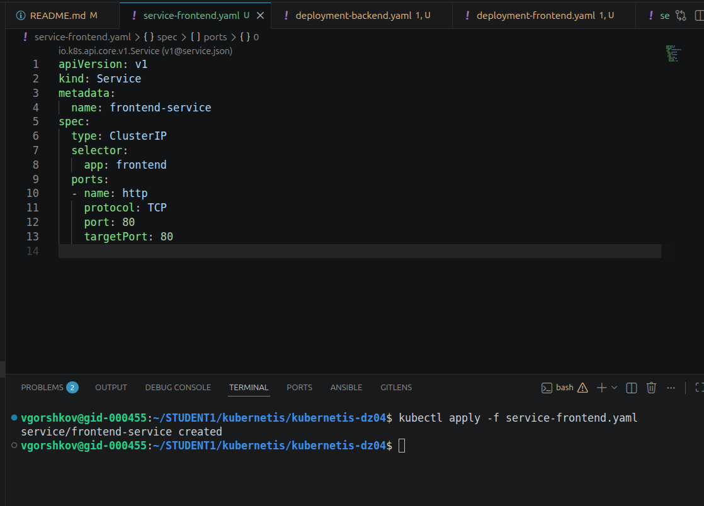

Открывает backend по пути /api.
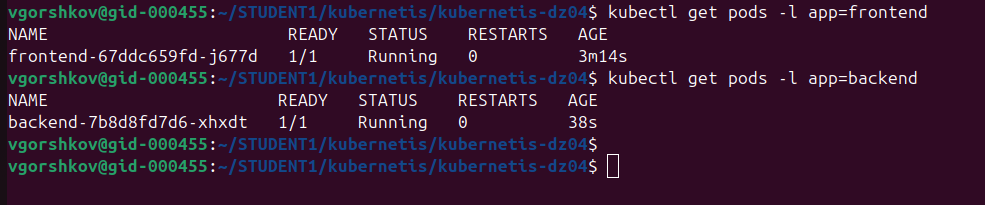

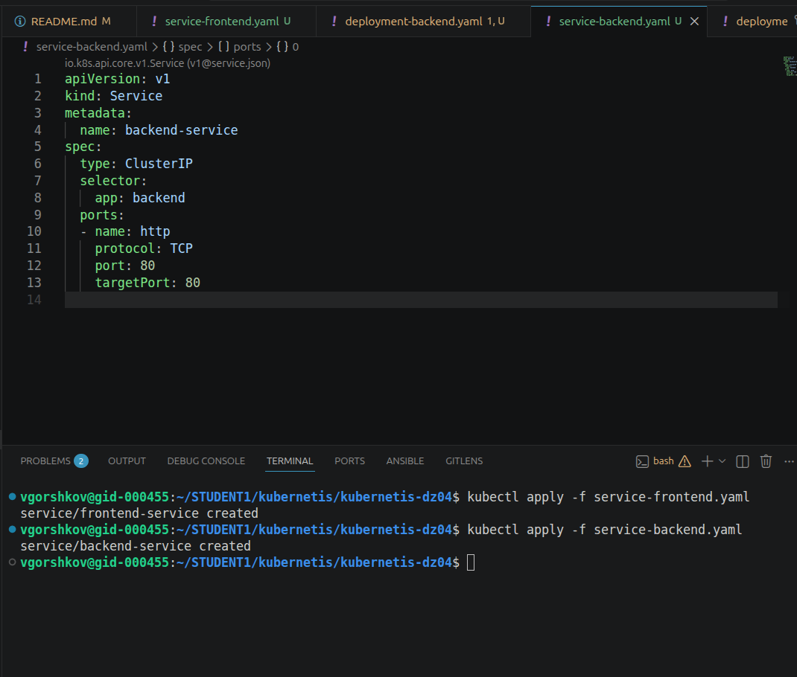

Тестируем создание
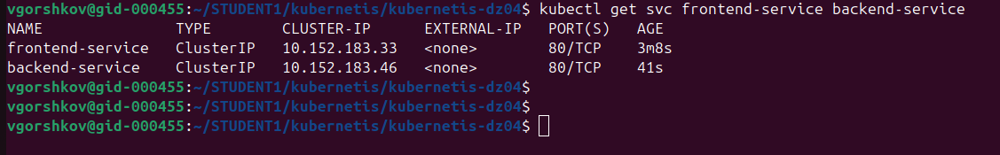

Проверить доступность:
 curl <host>/
 curl <host>/api
или через браузер.

Создадим ingress с нужными путями
[text](ingress.yaml)
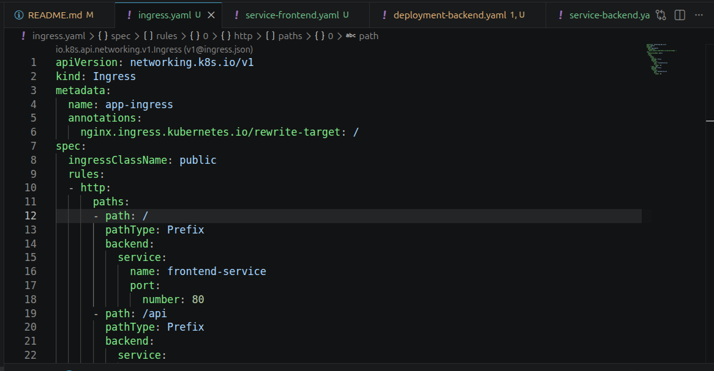

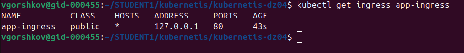

Работает!

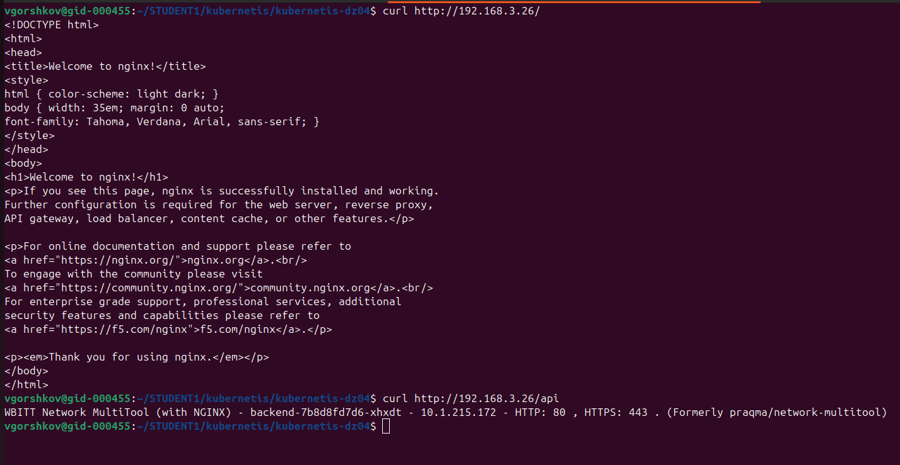

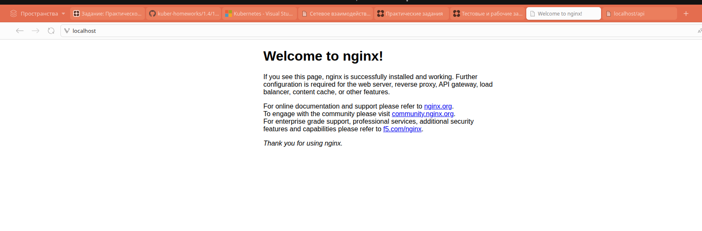

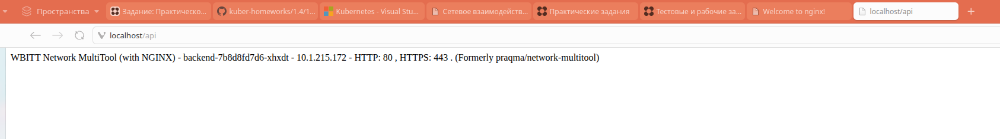

